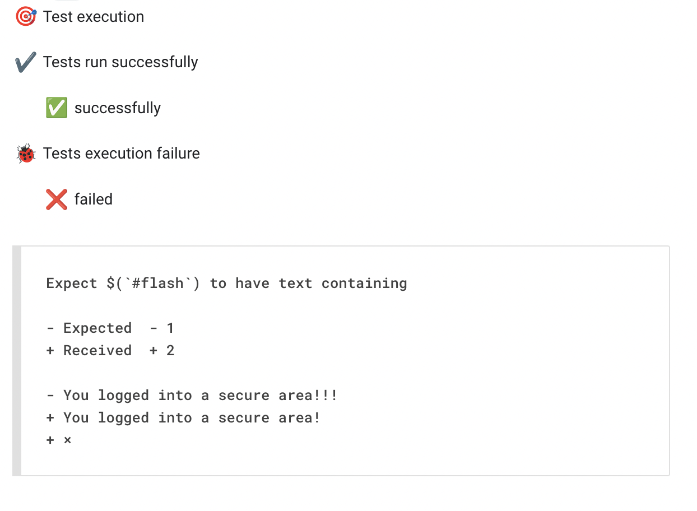

# wdio-google-chat-service

Webdriverio library to send test results as notification/off message to google chat spaces.

## Installation

`npm install wdio-google-chat-service --save-dev`

or

`yarn add wdio-google-chat-service`

## settings

First, import the service into the wdio configuration file `wdio.conf.js`

```
// wdio.conf.js
const slack = require('wdio-google-chat-service');
```

To use the service you need to have the google chat webhook url to send the notification and add the url in 'webhook'

Example:

```
services: [[GoogleChatService, {
            webhookUrl: 'https://chat.googleapis.com/v1/spaces/xxxxxxxxx/messages?key=xxxxxxxx&token=xxxxxxxxx',
            notifyOnlyOnFailure: false //Send notification only in case of test failure
        }]
],
```

## Getting google chat webhook

Note: Google chat only has the webhook for business accounts. If you use a personal account you should not have the webhook option.

1. Create a space on google chat
2. Click the arrow on the chat space name
3. Click [Manage Webhooks]
4. Add one or copy the presented webhook Url.
5. Paste the URL of the webhook in the service inside the option 'webhookUrl' as in the example above.

## Features

- Support for mocha runner
- Error details
- Send notification only in case of test failure

## Results


